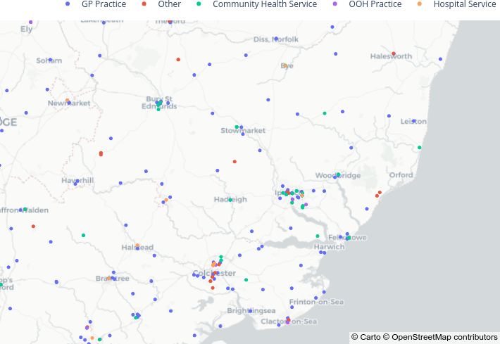

# ESNEFT Analysis - Diabetes Inequalities

[](https://github.com/GIScience/badges#experimental)

## Table of contents

  * [Installation](#installation)
  * [Setup](#setup)
  * [Retrieve Data](#retrieve-public-data)
    * [Download](#download)
    * [Process](#process)
      * [Aggregate By Practice Level](#aggregate-by-practice-level)
      * [Aggregate By LSOA Level](#aggregate-by-lsoa-Level)
      * [Compute Travel Time](#compute-travel-time)
  * [Visualise](#visualise)
    * [Practice Map](#practice-map)
    * [LSOA Map](#lsoa-map)
    * [Healthcare Accessibility](#healthcare-accessibility)
  * [License](#license)
  * [Contact](#contact)


## Installation

```bash
pip install git+https://github.com/nhsx/p24-pvt-diabetes-inequal.git
```

## Setup
The logging level of `esneft_tools` can be set via the `setVerbosity()` function.

```python
import logging
from esneft_tools.utils import setVerbosity
from esneft_tools import download, process, visualise

setVerbosity(logging.INFO)
```

## Retrieve Public Data

### Download
Each of the `esneft_tools.download.getData().fromHost()` functions retrieve a static copy of a particular data set from GitHub.
A local copy of these tables is saved to `./.data-cache/` by default.
Each can be obtained individually but it is recommended to retrieve all data, as below.

```python
# Instantiate data download class.
getData = download.getData(cache='./.data-cache')

# Retrieve all data as dictionary (recommended)
data = getData.fromHost('all')
```

  * `all` **(default)**
    * Retrieve all of the below data in dictionary format (**recommended**).
  *  `postcodeLSOA`
     * Postcode -> LSOA (2011) lookup Table from [ArcGIS](https://hub.arcgis.com/datasets/6a46e14a6c2441e3ab08c7b277335558/about)
  *  `imdLSOA`
     * Indices of Multiple Deprivation by LSOA in England from [National Statistics (.gov.uk)](https://assets.publishing.service.gov.uk/government/uploads/system/uploads/attachment_data/file/845345/File_7_-_All_IoD2019_Scores__Ranks__Deciles_and_Population_Denominators_3.csv/preview)
  *  `populationLSOA`
    * LSOA population estimates, by age and sex, from [ONS](https://www.ons.gov.uk/peoplepopulationandcommunity/populationandmigration/populationestimates/datasets/lowersuperoutputareamidyearpopulationestimates)
  *  `areaLSOA`
    * Land hectare measures by LSOA from [ArcGIS](https://hub.arcgis.com/datasets/ons::standard-area-measurements-2011-for-2011-census-areas-in-england-and-wales/about)
  * `gpRegistration`
    * GP registration by LSOA [NHS Digital](https://digital.nhs.uk/data-and-information/publications/statistical/patients-registered-at-a-gp-practice/metadata)
  * `gpPractice`
    * GP Practice information from [NHS Digital](https://digital.nhs.uk/services/organisation-data-service/file-downloads/gp-and-gp-practice-related-data)
  * `gpStaff`
    * GPs by GP Practices from [NHS Digital](https://digital.nhs.uk/services/organisation-data-service/file-downloads/gp-and-gp-practice-related-data)
  * `geoLSOA`
    * LSOA GeoJSON from [UK Data Service](https://statistics.ukdataservice.ac.uk/dataset/2011-census-geography-boundaries-lower-layer-super-output-areas-and-data-zones)
  * `esneftLSOA`
    * List of LSOAs within ESNEFT trust.
  * `esneftOSM`
    * OpenStreetMap (OSM) data for ESNEFT area from [Geofabrik](https://download.geofabrik.de/europe/great-britain/england.html)


### Processing

#### Aggregate by Practice Level
The `getGPsummary` function aggregates the downloaded data to practice level statistics.

```python
GPsummary = process.getGPsummary(**data, iod_cols='IMD')
```

| Field               | Description                                               |
| ---                 | ---                                                       |
| *OrganisationCode*  | Practice Service Code                                     |
| IMD                 | Mean Index of Multiple Deprivation of Registered Patients |
| Patient             | Total Registered Patients                                 |
| PCDS                | Postcode                                                  |
| OpenDate            | Opening Date                                              |
| CloseDate           | Closing Date                                              |
| Status              | Service Status (e.g. Active)                              |
| PrescribingSetting  | Service Type (e.g. GP Practice)                           |
| currentStaff        | Current Practitioners                                     |
| departedStaff       | Total Departed Practitioners                              |
| meanStaff           | Average Working Practitioners                             |
| annualStaffTurnover | Mean Annual % Practitioner Turnover                       |
| Lat                 | Latitude of Site                                          |
| Long                | Longitude of Site                                         |
| patientPerGP        | Total Registered Patient per Average Practitioner Count   |
| ESNEFT              | Boolean Flag of Practices within ESNEFT                   |
| Node                | Closest OSM Map Node to Site                              |

#### Aggregate by LSOA Level
The `getLSOAsummary` function aggregates the downloaded data LSOA level statistics.

```python
LSOAsummary = process.getLSOAsummary(**data, iod_cols='IMD')
```

  | Field        | Description                                |
  | ---          | ---                                        |
  | *LSOA11CD*   | LSOA (2011) Code                           |
  | LSOA11NM     | LSOA (2011) Name                           |
  | Age (median) | Median Age of Population                   |
  | Population   | Population Estimate (2011 Census)          |
  | LandHectare  | Land Area (Hectares)                       |
  | Patient      | Total Registered GP Patients               |
  | IMD          | Index of Multiple Deprivation              |
  | IMD (q5)     | Index of Multiple Deprivation (quintiles)  |
  | Density      | Population Density                         |
  | ESNEFT       | Boolean Flag of LSOAs within ESNEFT        |


#### Compute Travel Time
The `computeTravelDistance` function uses `OSMNX` to compute the minimum distance to the nearest healthcare service (e.g. GP practice) from any point in the ESNEFT region.

```python
activeGP = GPsummary.loc[
      (GPsummary['Status'] == 'Active')
    & (GPsummary['PrescribingSetting'] == 'GP Practice')
].copy()

distances = process.computeTravelDistance(data['esneftOSM'], activeGP, maxQuant=0.99)
```

| Field    | Description                                      |
| ---      | ---                                              |
| *Node*   | OSM Map Node                                     |
| Distance | Distances by Road (metres) to Nearest Service(s) |
| SiteIDs  | Practise Service Code(s) of Nearest Services     |

### Visualise

### Practice Map

```python
fig = visualise.scatterGP(GPsummary[GPsummary['Status'] == 'Active'], minCount=250)
fig.write_image('GP-locations.png')
```


 <br> *Map of Practice Distributions within ESNEFT (Plotly Interactive)*


### LSOA Map

```python
fig = visualise.choroplethLSOA(LSOAsummary, data['geoLSOA'], colour='IMD')
fig.write_image('LSOA-choropleth.png')
```


 <br> *Choropleth Map of LSOA Domains within ESNEFT coloured by IMD (Plotly Interactive)*

### Healthcare Accessibility

```python
fig, ax = visualise.plotTravelTime(
    data['esneftOSM'], distances, maxQuant=0.95, out='GP-accessibility.png')
```


 <br> *Heat map visualising distance to nearest GP Practice within ESNEFT*

## License
Distributed under the MIT License. _See [LICENSE](./LICENSE) for more information._

## Contact

If you have any other questions please contact the author **[Stephen Richer](https://www.linkedin.com/in/stephenricher/)**
at stephen.richer@nhs.net
