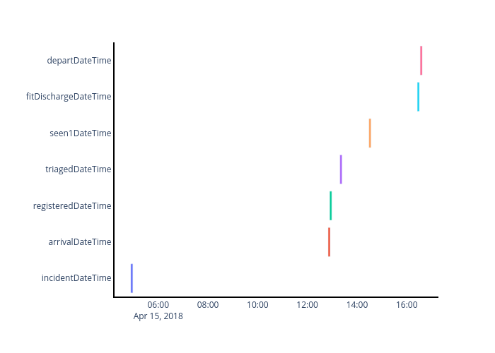
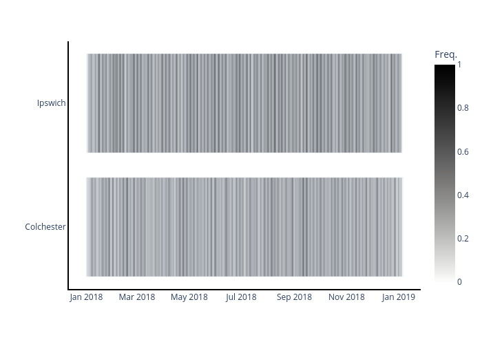

# ESNEFT Analysis - Diabetes Inequalities

## Additional documentation and example visualisations

**Note: This documentation is still a work progress and will be updated.**

## Table of contents

  * [Timeline Visualisation](#timeline-visualisation)
  * [Healthcare Accessibility](#healthcare-accessibility)
    * [Compute Travel Distance](#compute-travel-distance)
    * [Plot Travel Distance](#plot-travel-distance)


## Timeline Visualisation
Basic functionality is included to visualise events on a timeline.
```python
import pandas as pd
from esneft_tools import synthetic, process, visualise
```


### Event Level Timeline (theograph)
The `process.prepTime` function take event-level data in long-format and prepares it for visualisation.
Start times are required but end times are optional. The `interval` parameter enforces a minimum length for each event to facilitate visualisation.

```python
# Generate a synthetic datapoint
data = synthetic.emergency(size=1, seed=52)
times = ([
    'incidentDateTime', 'arrivalDateTime', 'registeredDateTime',
    'triagedDateTime', 'seen1DateTime', 'seen2DateTime',
    'fitDischargeDateTime', 'departDateTime'
])
# Convert to long-format
df = pd.melt(data, id_vars='patientID', value_vars=times)

# Prepare for visualisation - enforce minimum event lengths of 300s.
df = process.prepTime(
    df, start='value', end=None, interval='300s',
    group='variable', index='patientID')
fig = visualise.timeline(df, colour='group')
fig.show()
```

 <br> *Example of event-level timeline visualisation using synthetic data*


### Event Frequency Timeline
The `process.summariseTime` function accepts data processed by `process.prepTime`.
It computes event frequency at set intervals.
Frequency is scaled to 1 and may be normalised within each group, or across the entire dataset.

```python
data = synthetic.emergency(size=10_000, seed=42)
df = process.prepTime(
    data, start='arrivalDateTime', end='departDateTime',
    group='site', interval='1D')
df = process.summariseTime(df, interval='1D', normByGroup=True)
fig = visualise.timeline(df)
fig.show()
```

 <br> *Example of event-frequency timeline using synthetic data*


### Healthcare Accessibility
**Note: This functionality requires OSMnx installation**

#### Compute Travel Distance
The `computeTravelDistance` function uses `OSMNX` to compute the minimum distance to the nearest healthcare service (e.g. GP practice) from any point in the ESNEFT region.

```python
activeGP = GPsummary.loc[
      (GPsummary['Status'] == 'Active')
    & (GPsummary['PrescribingSetting'] == 'GP Practice')
].copy()

distances, unchecked = process.computeTravelDistance(
    data['esneftOSM'], activeGP, dist=20000)
```

| Field    | Description                                      |
| ---      | ---                                              |
| *Node*   | OSM Map Node                                     |
| Distance | Distances by Road (metres) to Nearest Service(s) |
| SiteIDs  | Practise Service Code(s) of Nearest Services     |


#### Plot Travel Distance
```python
fig, ax = visualise.plotTravelTime(
    data['esneftOSM'], distances, maxQuant=0.95, out='GP-accessibility.png')
```


<br> *Heat map visualising distance to nearest GP Practice within ESNEFT*
